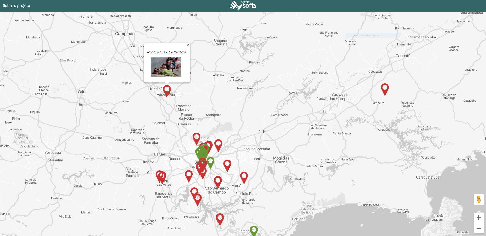
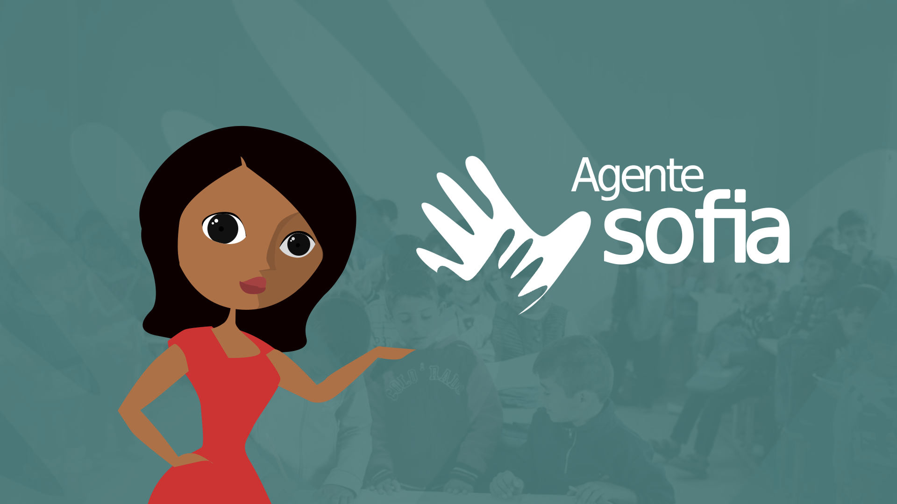
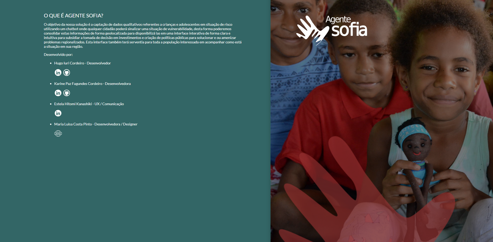

# agente-sofia-project-web
Projeto para o The Big Hackathon na Campus Party Brasil 12 com o qual conseguimos o 1º lugar na categoria Direitos Humanos e o 3º lugar na final.

Neste projeto fizemos uma assistente social virtual. Ela conversa com as pessoas por um chatbot automático que fizemos utilizando o [Blip](https://blip.ai/).
Além disso desenvolvemos uma aplicação web que exibe os dados enviados pelo chat em um mapa.

O back-end da aplicação se encontra do repositório [agente-sofia-api](https://github.com/marialuisacp/agente-sofia-api).

      
