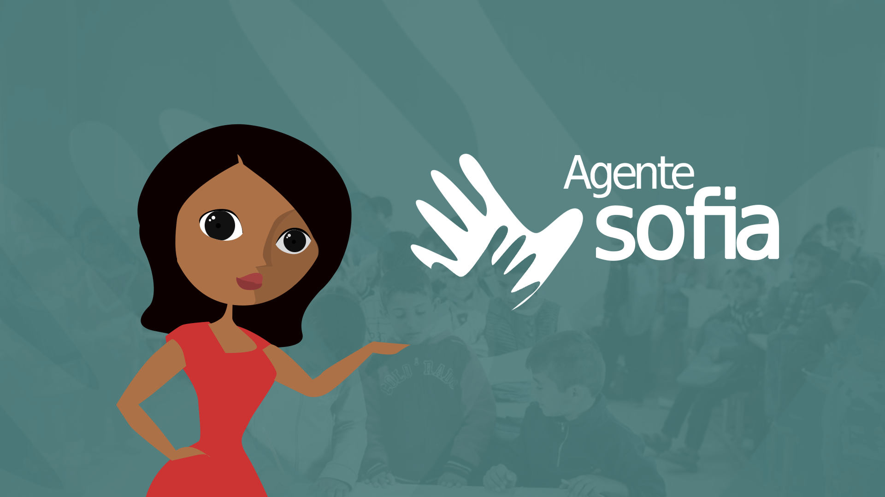
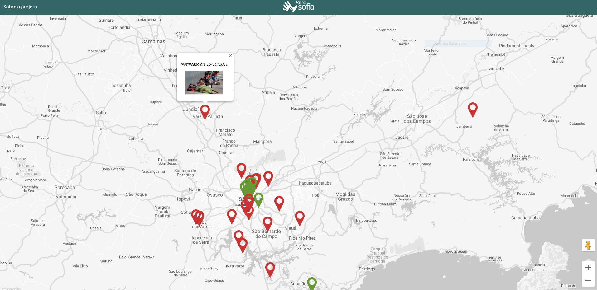

# agente-sofia-project-web
Projeto para o The Big Hackathon na Campus Party Brasil 12 com o qual conseguimos o 1º lugar na categoria Direitos Humanos e o 3º lugar na final.
No hackathon foram apresentados seis temas e as equipes tinham que apresentar soluções para um ou mais dentre os temas propostos. Neste trabalho nós criamos uma solução para uma questão relacionada a Direitos Humanos, envolvendo crianças em situação de risco.

Fizemos uma assistente social virtual chamada Sofia. Ela conversa com as pessoas por um chatbot automático e coleta informações referentes a crianças em situação de vulnerabilidade. O chat foi feito pelo [Blip](https://blip.ai/). Além disso desenvolvemos uma aplicação web que exibe os dados enviados pelo chat em um mapa.

O back-end da aplicação se encontra do repositório [agente-sofia-api](https://github.com/marialuisacp/agente-sofia-api).

      
Este projeto foi desenvolvido com [Hugo Iuri](https://github.com/hugoiuri), [Karine Paz Fagundes](https://github.com/kpazfagundes) e [Estela Kanashiki](https://www.linkedin.com/in/estela-kanashiki-1714073a/) em fevereiro de 2019 na CPBR12 em São Paulo.
